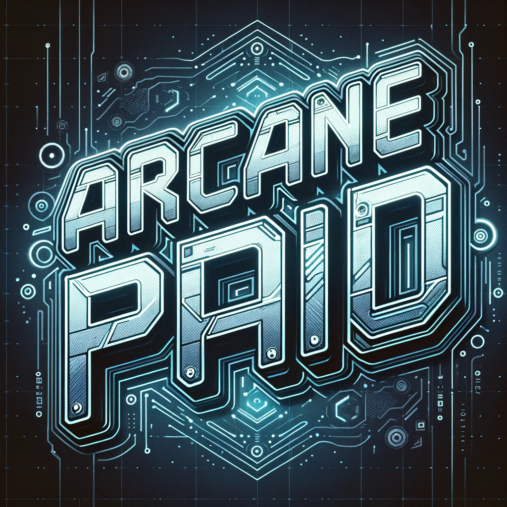

# Monetization

At the moment we don't offer an integrated system for selling your games, but we plan to develop it in the future.
In the meantime, you can monetize your Arcanepad games in a few other ways if you get a bit creative, for example:

- Crowdfunding campaign on kickstarter, indiegogo or any other platform
- Selling your games on itch.io or another platforms. 

The only difficulty is that your users will have to add the app manually, we will try to improve UX as much as possible so this process is entirely automated. If you have any feedback or questions let us know on our discord channel.

We will give you all the support we can and promote your game if it meets a minimum quality standard criteria.

