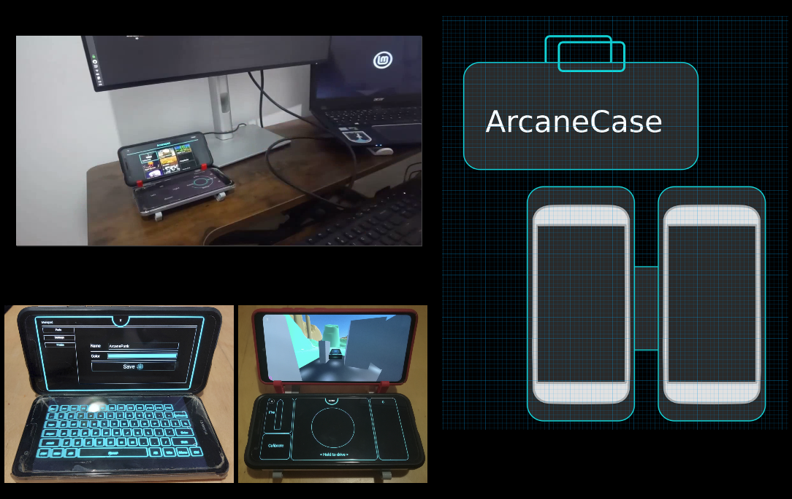
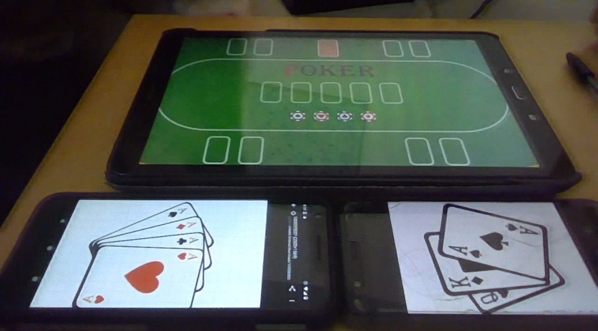
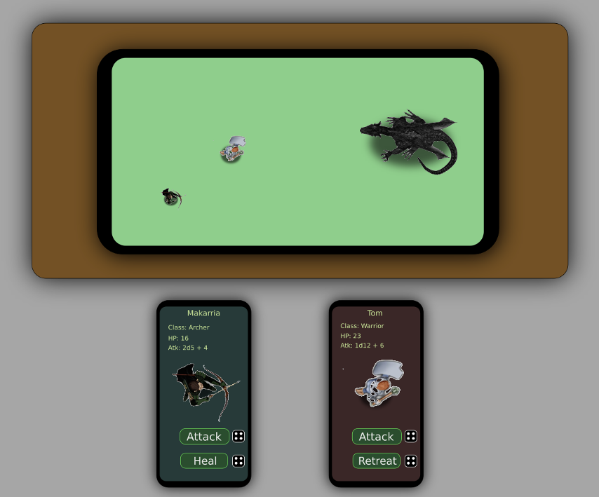
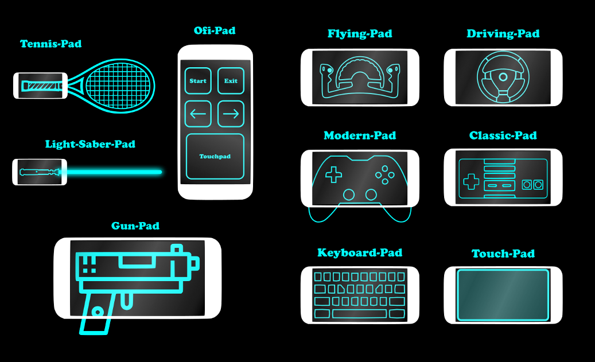
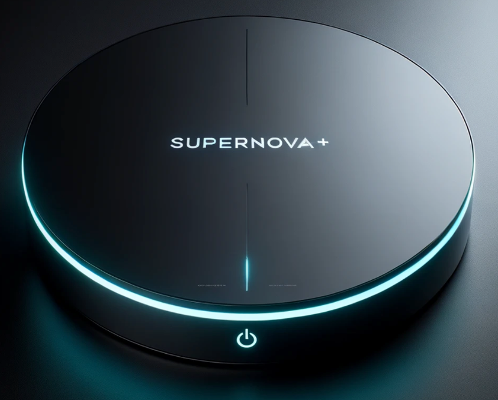
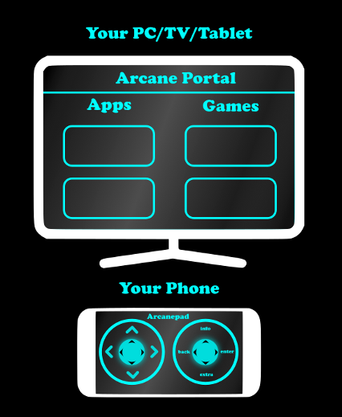
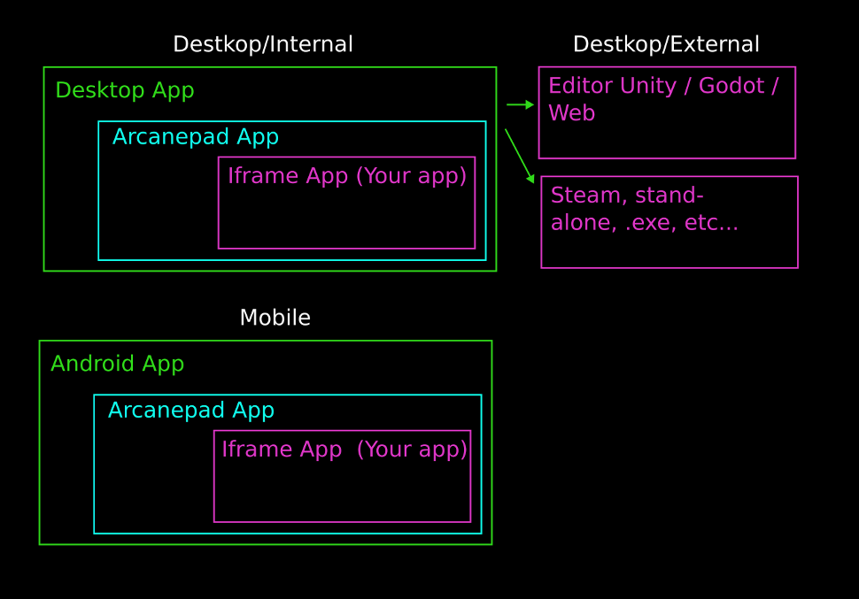
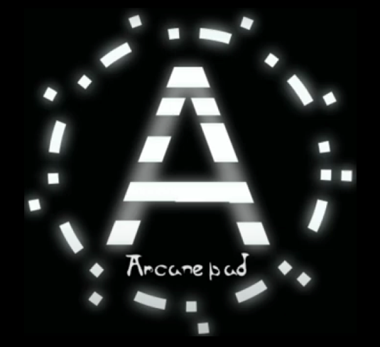

# Cool Ideas and Random Stuff

This section has ideas on how to implement Arcanepad and random stuff that I'v made.

## Portable Mode

Arcanepad could be used to convert two phones into a versatile portable gaming console

The only limitation at the moment is that it would still require a PC to work as a server. Im willing to add server support for android devices but that will take time. 

## Arcane Cards

Arcanepad could be used to make LAN card games that use a tablet as the table where all the action happens, while each player can view they're own cards with they're phones, this idea could be taken to another level by adding interactions, messages between players, hidden strategies, etc.

## Arcane Dungeons

## Ideas

## Console 

## Ilustration

## Architecture

## Old Logo

