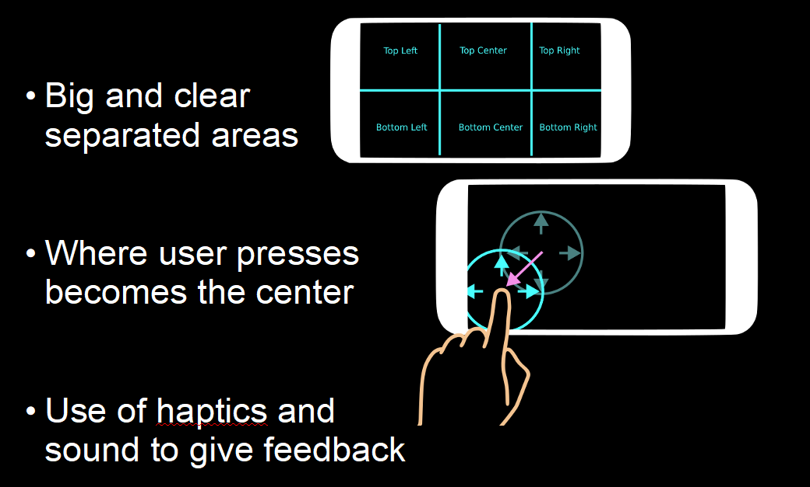

# UX Recomendations

This are some ideas on how you could improve user experience, avoiding making your users having to be switching the screen they look constantly, for example by making the place where they press be always the center, by providing haptics and sound feedback and in general asking yourself how your game can be more pleasant for your users to play. This is just a recomendation and of course you are free to take a different approach.

## Gamepad User Experience

