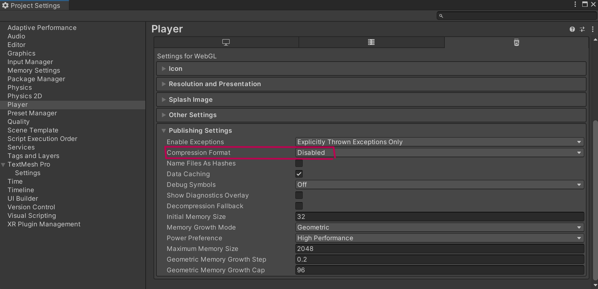

# 🚧 👷 Work in Progress 👷 🚧
##
# Getting Started with ArcanePad

Welcome to ArcanePad! This guide will help you get started with integrating ArcanePad into your projects, whether you are developing for web, Godot, or Unity.

## Setup from Zero

If you want to start an Arcanepad Project in Unity from scratch you need to follow this steps, otherwise you can download the starter repo and skip this part.

### 1. Get the SDK
Download the arcanepad-unity-sdk unity package from this link: https://github.com/imvenx/arcanepad-unity-sdk/releases and import it in your unity project

### 2. Add Natvie Web Sockets
Select "Add package by git url" and add this to the url
https://github.com/endel/NativeWebSocket.git#upm

### 3. Add Newtonsoft
Select "Add package by name" and write this on the name:

com.unity.nuget.newtonsoft-json

### 4. Set compression format to disabled
On `Edit -> Project Settings -> Player -> WebGL settings -> Publishing Settings` set `Comperssion format` to `disabled` 

## Starter Template Repo

https://github.com/imvenx/unity-starter-template-arcanepad

::: code-group
<<< ./template-code/ViewManager.cs
<<< ./template-code/PadManager.cs
<<< ./template-code/Player.cs
<<< ./template-code/Models.cs
:::