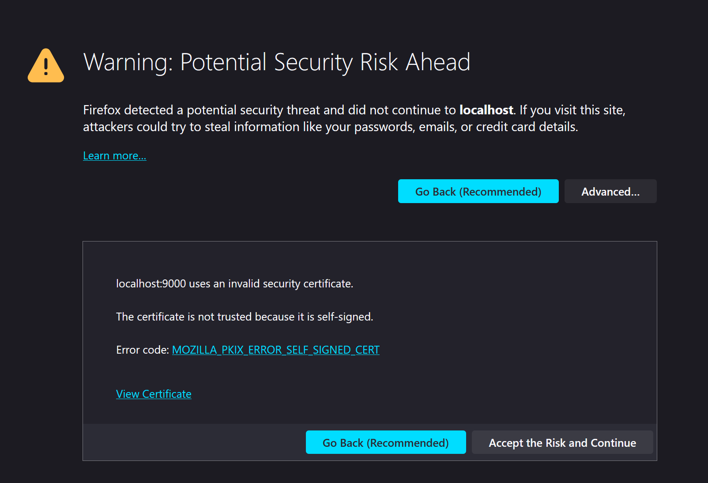
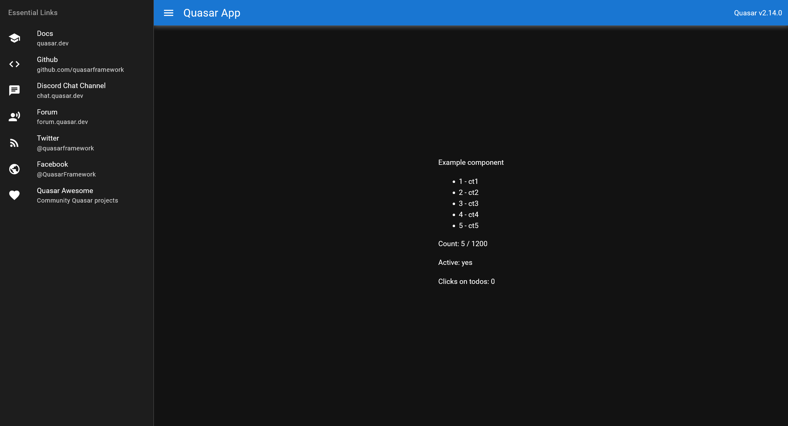

# Getting Started with ArcanePad on Web

Welcome to ArcanePad! This guide will help you get started with integrating ArcanePad into your web projects.

If you haven't installed the app yet, please refer to [this guide](/guide/get-started) and follow the instructions to install ArcanePad desktop and mobile apps before continuing.

We are going to use Quasar.js, a framework on top of Vue.js. The reason for this is that Quasar comes with a lot of tools out of the box that are going to make our development journey a lot easier. For more information, visit [quasar.dev](https://quasar.dev) to get started.

## Things you need to have installed

1. Visual Studio Code
2. Node.js
3. NPM
4. Vue
5. Quasar

## Create a Quasar Project

``` shell
npm i -g @quasar/cli # Run this line if you haven't installed Quasar yet
npm create quasar
```

By default I'm selecting this options: 

``` shell

√ What would you like to build? » App with Quasar CLI, let's go!
√ Project folder: ... arcanepad-web-tutorial
√ Pick Quasar version: » Quasar v2 (Vue 3 | latest and greatest)
√ Pick script type: » Typescript
√ Pick Quasar App CLI variant: » Quasar App CLI with Vite
√ Package name: ... arcanepad-web-tutorial
√ Project product name: (must start with letter if building mobile apps) ... Arcanepad Tutorial
√ Project description: ... A tutorial for Arcanepad
√ Author: ... v
√ Pick a Vue component style: » Composition API with <script setup>
√ Pick your CSS preprocessor: » None (the others will still be available)
√ Check the features needed for your project: »

```

Then we navigate inside our project and open it in visual studio code:

``` shell
cd arcanepad-web-tutorial
code .
```

## Configure Project

1. In your project's `quasar.config.js`, set `https: true` to enable HTTPS.
2. Optional: Set `config: { dark: true }` in the same configuration file to enable the dark theme.

Your file now should look like this:

::: code-group
``` js {2,8} [quasar.config.js]
devServer: {
    https: true, 
    open: true
},

framework: {
    config: {
        dark: true
    },
```
:::

Now we run:

``` shell
npm run dev 
```

we see a warning because the certificate is self signed, click on advanced and accept the risk and continue



After clicking continue, we can see our Quasar App



## Clean Up Project

Remove all boilerplate code from the MainLayout.vue and IndexView.vue to start with a clean slate.

::: code-group
``` vue [src/pages/IndexPage.vue]
<template>
  <h1>Index Page</h1>
</template>

<script setup lang="ts">
</script>
```
:::
::: code-group
``` vue [src/layouts/MainLayout.vue]
<template>
  <router-view />
</template>

<script setup lang="ts">
</script>

```
:::
### Installing the ArcanePad Web SDK

To integrate ArcanePad into your web application, start by installing the ArcanePad Web SDK. 

1. **Install via NPM:**
   Open your terminal and run the following command in your project directory:

    ```bash
    npm install arcanepad-web-sdk
    ```

This command installs the ArcanePad Web SDK, allowing you to easily integrate ArcanePad functionality into your web applications.
